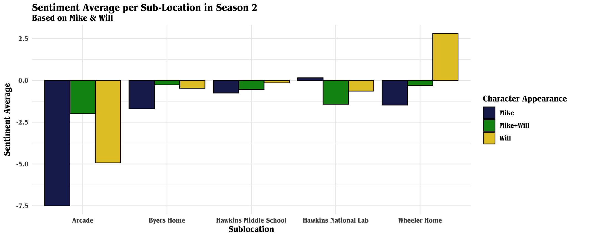

# Stranger Things: An Analysis of Character, Location, and Sentiment 

*Stranger Things* has been a pop culture phenomenon since it originally aired in 2016. The first half of the latest and final season dropped on November 26, 2025. The show features an intricate network of characters and locations, whose interactions can be studied to identify patterns among the appearances of characters.

The research question for this analysis is:

"Can we predict if someone will be in a scene based on sentiment, character presence, and location?"

Specifically, in this analysis, the "someone" will be Mike Wheeler. Mike is one of the main characters in Stranger Things, and he appears in numerous scenes throughout seasons 1 and 2. This means he has a large dataset to pull from to understand the patterns of his behavior.

## Datasets

Two datasets were used in this analysis:

-   **TidyTuesday**: contains all of the dialogue and episodes of *Stranger Things*

-   [**Jeffrey Lancaster**](%22%3Chttps://raw.githubusercontent.com/jeffreylancaster/stranger-things/master/data/episodes.json%3E%22): contains all of the information about specific scenes from *Stranger Things*, including characters that are present

An additional dataset, **stranger_words**, was created to assist in the data analysis as a sentiment assigner to *Stranger Things* specific words.

Because the **Jeffrey Lancaster** dataset only contains information from the first two seasons, this analysis is solely of the patterns of the first two seasons of Stranger Things.

This adds the font of *Stranger Things* to the project.

```{r font-addition, warning=FALSE}
showtext_auto()
font_add(family = "Benguiat", regular = "itc-benguiat-std/ITCBenguiatStdBoldCn.OTF")
```

I found how to add fonts at this site: <https://github.com/yixuan/showtext>





## Limitations 

There were many limitations to this analysis. First, sentiment data is very difficult to deal with. If I were to expand this, I would want to research to see if there are more proven algorithms to determine the sentiment of a sentence. Sentiment alone doesn't take into account the context in which the words are said, and character presence and location alone cannot truly make up for that. It is also important to know who is speaking to whom, which is not possible in this dataset. This is likely why the sentiment variable didn't have a large effect on whether Mike was in a scene.

Another limitation is that this data is only from the first two seasons. It would be interesting to see how character interactions change and how the overall sentiment of the show changes. For a true analysis of *Stranger Things*, all seasons would need to be used.

This data is also not perfect. It was very difficult to try to match the scenes with the dialogue to determine the sentiment of the scenes and who is present in them.

## Conclusion 

Overall, the best predictor of whether or not Mike is in a scene is a combination of Dustin's presence and the sub-location. However, these are the best predictors because the data is limited. There is not a lot of actual data on what is happening in these scenes, so it is impossible to know if this would work with the rest of the seasons.

It would be more interesting to see if models could predict the sentiment of a scene based on data, or if two characters are present together in a scene. Again, this would need to be done with a more complete dataset.

To answer my original question, yes, it is possible to predict whether or not Mike will be in a scene based on character presence, location, and scene sentiment.
